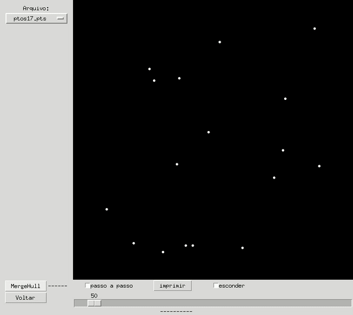
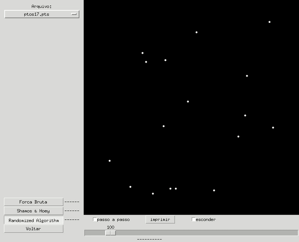
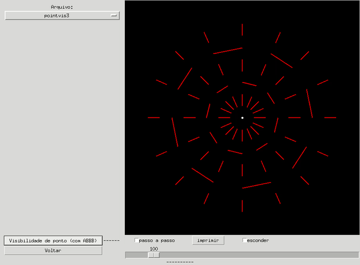
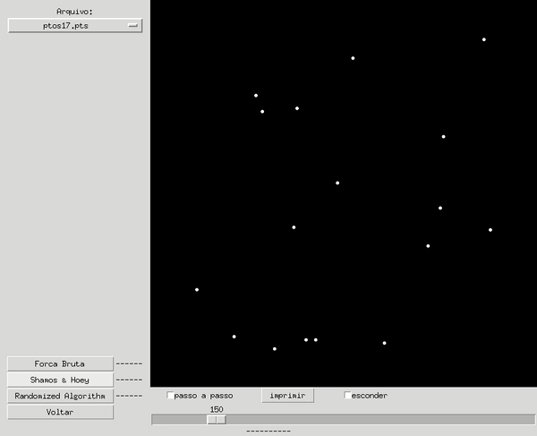

Front-end criado por:
 - alexis at ime dot usp dot br ( Alexis Sakurai Landgraf, criador
  original do arcabouço)
 
 - victorsp at ime dot usp dot br (Victor, responsável pela adaptação
   para python3)

Para rodar o tkgeocomp.py vai precisar de Python (testado com aa versão 
3.5.4, mas 3.x.x deve funcionar).  Além disso, tkgeocomp.py precisa do 
módulo padrão de Tk que acompanha a distribuição de Python.

O arquivo geocomp/config.py pode ser alterado para mudar cores, tamanho
da janela, largura da linha, etc.

O programa tenta carregar automaticamente o primeiro arquivo do
diretório "dados". Depois disso, é possível abrir arquivos em outros
diretórios, usando o "menu" na parte superior esquerda da tela.

Depois de rodar um algoritmo, o programa mostra o número de operações
primitivas realizadas pelo algoritmo ao lado do seu botão. Alguns
algoritmos podem retornar informações adicionais que são mostradas na
parte inferior da janela.

O tempo entre dois passos de um algoritmo pode ser alterado
dinamicamente durante a sua execução e também é possível executar apenas
uma pequena parte do algoritmo passo a passo, bastando para isso usar
o botão "passo a passo". Algumas vezes, é desejável apenas medir a
eficiência de um algoritmo para uma determinada entrada. Como qualquer
algoritmo leva mais tempo desenhando do que fazendo conta, é possível,
antes de iniciar um algoritmo, apertar o botão "esconder" para não
desenhar nada na tela, permitindo que o algoritmo rode bem mais rápido.

O front-end tkgeocomp.py permite salvar a imagem que está desenhada
em um determinado instante na tela, bastando para isso apertar o botão
"imprimir". O formato da imagem criada é .eps (Encapsulated Postscript).

para rodar o algoritmo de par de pontos mais próximo em todos os arquivos 
dados/LOOSE_PTS/ptos*.

----------------------------------EP4----------------------------------------------
O algoritmo implementado foi o MergeHull. 

O código adicionado está no diretório: geocomp/convex_hulls/mergehull.py.

A divisão dos pontos é sinalizada pelo segmento verde; 
O fecho é representado pelos segmentos da cor laranja;
Ao juntar o fecho da esquerda com o da direita, o fecho da esquerda fica vermelho e o da direita azul;
Os testes de esquerda e de direita são sinalizados pela cor amarela;
Os pontos tangentes são sinalizados pela reta da cor ciano.

----------------------------------EP3----------------------------------------------
O algoritmo implementado foi o par de pontos mais próximo utilizando o algoritmo probabilístico. 

O código adicionado está no diretório: geocomp/closest/randomized.py.

A estrutura de dados utilizada foi um dicionário, pois a busca custa tempo esperado O(1). Mantendo a complexidade do algoritmo.

Os pontos que estão no dicionário estão pintados de azul; o ponto processado é pintado de amarelo.

Ao reconstruir o grid, todos os pontos voltam a serem brancos, e os j-ésimos são re-inseridos no dicionário, ficando um a um azul novamente.

Ao final o par de pontos com menor distância é sinalizado com a cor vermelha.

----------------------------------EP2----------------------------------------------
O algoritmo implementado foi o de Segmentos visíveis a partir de um ponto.

O código adicionado está no diretório: geocomp/visibility/visibility_poiny.py.

Ao executar é feito um pre-processamento alinando os segmentos e pontos eventos, Ao iniciar a linha de varredura a partir do ponto, é verificado quais segmentos intersectam a linha. A verificação é demostrado mudando a cor do segmento para pink e os que intersectam são adicionado a AVL e são pintados de azul. Para marcar que o segmento é visto pelo ponto, acor é modificada para amarelo.

----------------------------------EP1----------------------------------------------
O algoritmo implementado foi o de divisão e conquista para encontrar o par de pontos mais próximos, versão bonita que vimos na aula.

O código adicionado está no diretório: geocomp/closest/shamos_hoey.py.

Para executar, é preciso abrir o terminal na pasta raiz da plataforma e executar: python3 tkgeocomp.py

Ao executar, é mostrado a divisão dos pontos através de uma linha vertical verde. Ao realizar o cálculo de distância entre dois pontos, os mesmos ficam com a cor amarela e é mostrado o segmento entre eles.

É mostrado duas linhas verticais laranjas sinalizando a faixa pontos que estão a uma distância menor que d = min{dE, dD} da reta vertical x = X[q].

Ao final o par de pontos com menor distância é sinalizado com a cor veremelha e um segmento em azul.

